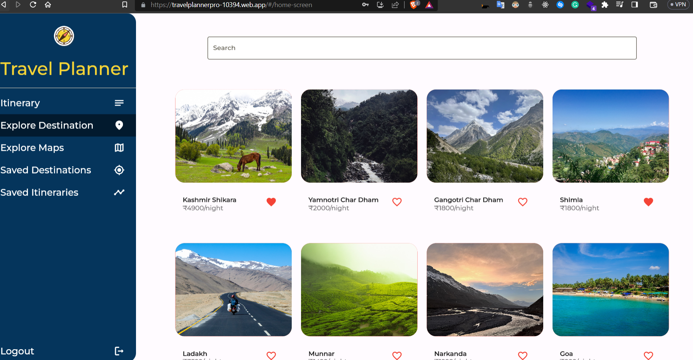
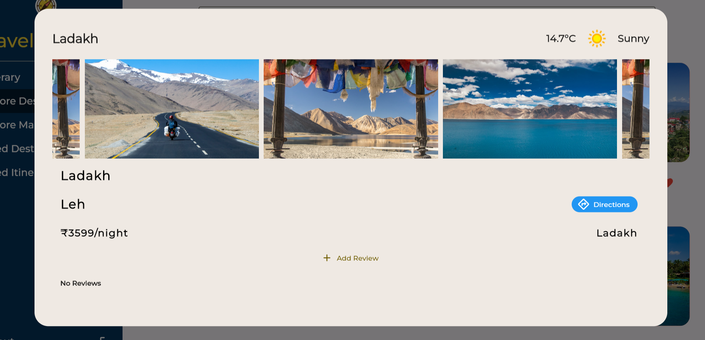
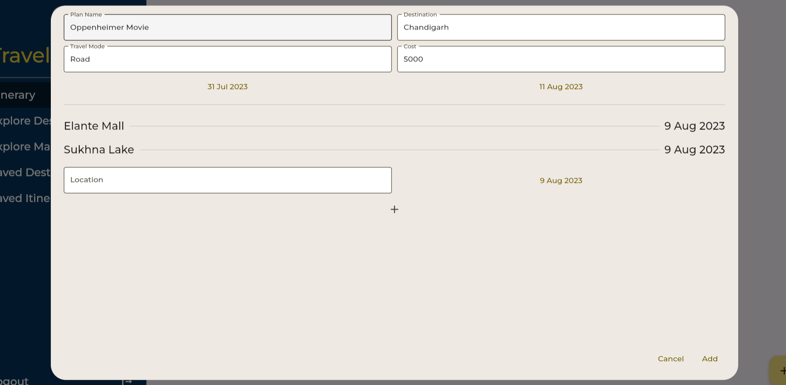
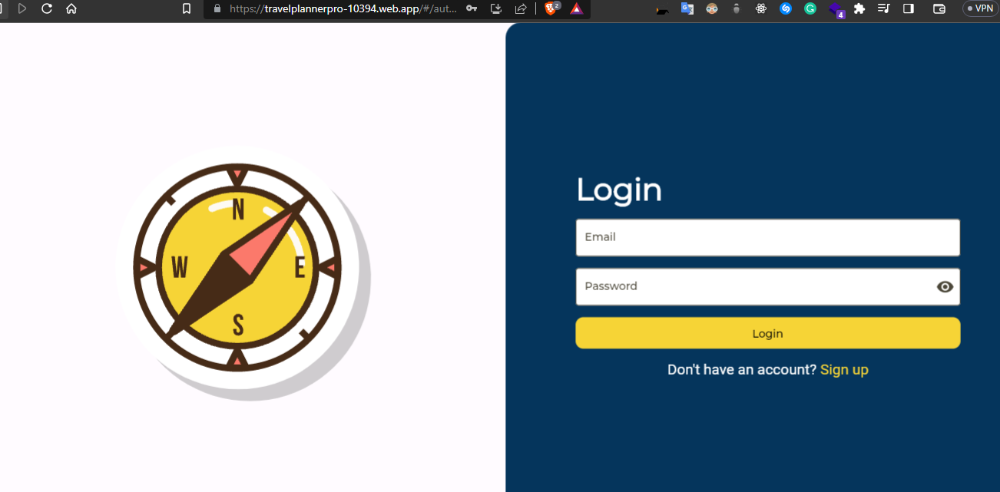
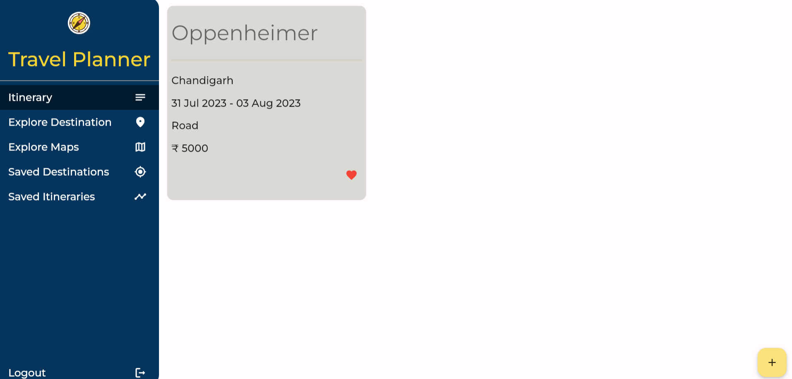
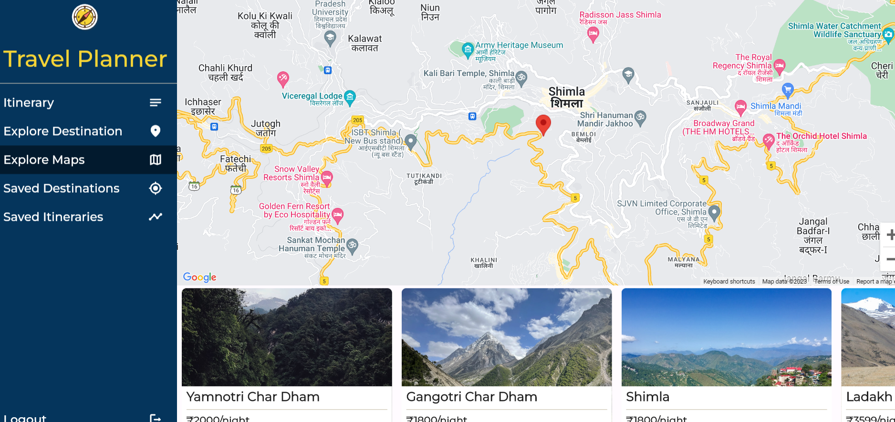
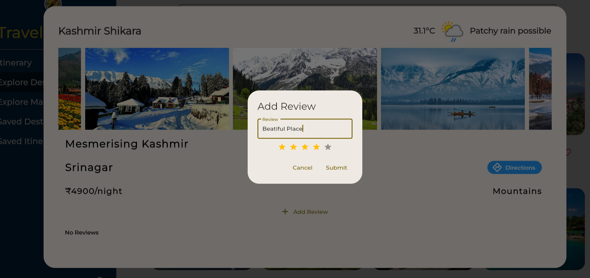
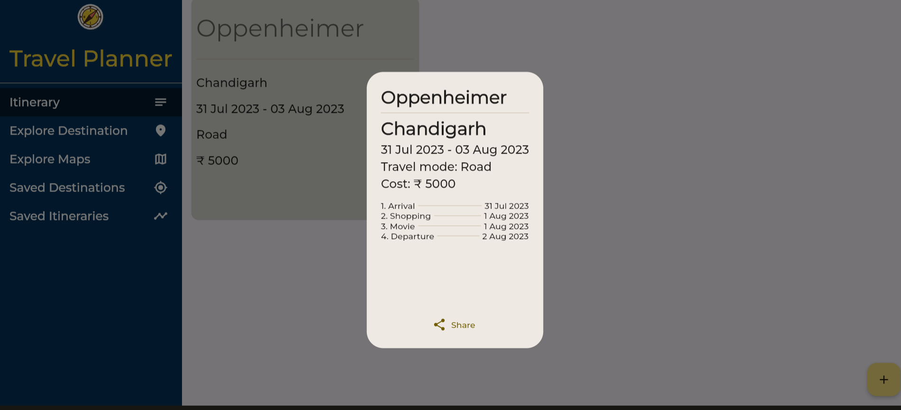

# Travel Planner Pro

Website Link - https://travelplannerpro-10394.web.app/

Backend Repo Link  - https://github.com/itsadityap/Travel-Planner-Pro

## Tech Stack


## Features


* Destination Search: Users can search for travel destinations based on keywords, such as city
names or landmarks.



* Destination Details: Display detailed information about each destination, including popular
attractions, weather, and average travel expenses.



* Itinerary Planner: Users can create and customize their travel itineraries, adding activities and
landmarks they want to visit on specific dates.



* User Authentication: Allow users to sign up and log in to save their itineraries and favourite
destinations.



* User Dashboard: Provide a personalized dashboard where users can view their saved itineraries
and favorite spots.



* Interactive Map: Show destinations, landmarks, and planned activities on an interactive map
for better visualization.



* Reviews and Ratings: Allow users to leave reviews and ratings for destinations and activities
they have visited.




* Social Sharing: Implement social media sharing options for users to share their planned trips
with friends and family.



# Installation

Install Flutter and Dart

```bash
  git clone git@github.com:CH1NRU5T/Travel-Planner-Pro.git
  flutter pub get
  flutter run
```

# Environment Variables
```bash
BASEURL - {BASE URL of the backend}
KEY - {Google Maps API Key}
``````